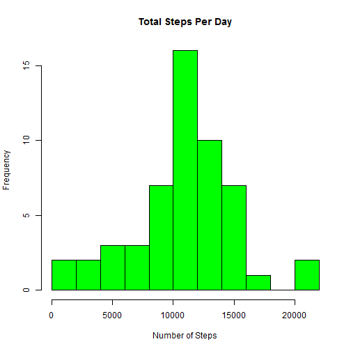
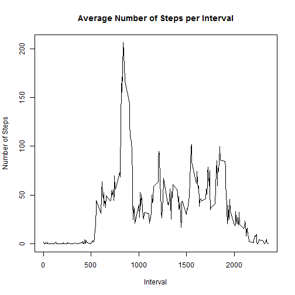
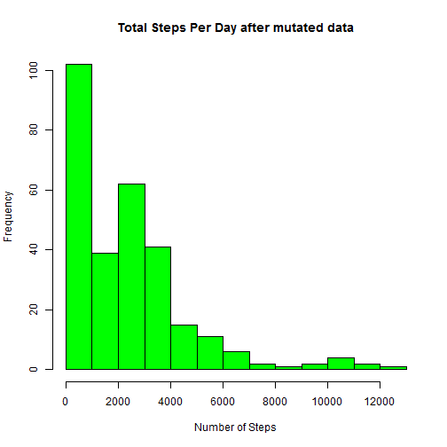

## Reproducible reseach

Collection of large amount of data about personal movement using activity monitoring devices such as a Fitbit, Nike Fuelband, or Jawbone Up is possible now-a-days. Mesaurements were taken by a group of enthusiasts themselves to improve their health, to find patterns in their behavior, or because they are tech geeks. But these data remain under-utilized both because the raw data are hard to obtain and there is a lack of statistical methods and software for processing and interpreting the data.

This analysis makes use of data from a personal activity monitoring device. This device collects data at 5 minute intervals through out the day. The data consists of two months of data from an anonymous individual collected during the months of October and November, 2012 and include the number of steps taken in 5 minute intervals each day.

The source data is available in __activity.zip__ (https://d396qusza40orc.cloudfront.net/repdata%2Fdata%2Factivity.zip)

The variables included in this dataset are:

steps: Number of steps taking in a 5-minute interval (missing values are coded as NA)
date: The date on which the measurement was taken in YYYY-MM-DD format
interval: Identifier for the 5-minute interval in which measurement was taken

The dataset is stored in a comma-separated-value (CSV) file and there are a total of 17,568 observations in this dataset.

The analysis will try to answer the questions asked in this assignemnt.

Downloading and unzipping the files for data processing in 2 steps as follows:

```r
download.file("http://d396qusza40orc.cloudfront.net/repdata%2Fdata%2Factivity.zip","activity.zip")
unzip("activity.zip")
```
Here, primary use of library __sqldf__ is done for processing data.

## 1. What is mean total number of steps taken per day?
Read the data, 

```r
library(sqldf)
```

```
## Loading required package: gsubfn
```

```
## Loading required package: proto
```

```
## Loading required package: RSQLite
```

```r
r<-read.csv("activity.csv")
colnames(r)<-c("steps","dt","interval")
```
Data preparation and plotting

```r
sum_steps_per_day<-sqldf("select dt, sum(steps) sum_steps from r group by dt")
```

```
## Loading required package: tcltk
```

```
## Warning: Quoted identifiers should have class SQL, use DBI::SQL() if the
## caller performs the quoting.
```

```r
hist(sum_steps_per_day$sum_steps, main = paste("Total Steps Per Day"), col="green", xlab="Number of Steps", breaks = 12)
```



The mean and median is

```r
mean(sum_steps_per_day$sum_steps, na.rm = TRUE)
```

```
## [1] 10766.19
```

```r
median(sum_steps_per_day$sum_steps, na.rm = TRUE)
```

```
## [1] 10765
```

## 2. What is the average daily activity pattern?

Average steps taken interval and plotting the prepared data

```r
avg_steps_per_interval<-sqldf("select interval, avg(steps) avg_steps from r group by interval")
plot(avg_steps_per_interval$interval,avg_steps_per_interval$avg_steps, type="l", xlab="Interval", ylab="Number of Steps",main="Average Number of Steps per Interval")
```



The 5-minute interval, on average across all the days in the dataset, contains the maximum number of steps is

```r
sqldf("select interval, avg_steps from avg_steps_per_interval order by 2 desc limit 1")
```

```
##   interval avg_steps
## 1      835  206.1698
```

## 3. Missing values imputation

There are a number of days/intervals where there are missing values (coded as NA). The presence of missing days may introduce bias into some calculations or summaries of the data. Calculate and report the total number of missing values in the dataset (i.e. the total number of rows with NAs)


```r
sum(!complete.cases(r))
```

```
## [1] 2304
```

Missing values are imputed where day-wise means are inserted in place of __NA__.
Checking the date by finding the day name and evaluating whether this is a weekday or a weekend
 * Evaluating day name and appending column to the dataset

```r
day_name<-strftime(r$dt,"%a")
r<-cbind(r,day_name)
r<-sqldf("select steps, dt, interval, day_name, case day_name when 'Sat' then 'Weekend' when 'Sun' then 'Weekend' else 'Weekday' end as Indicator from r")
```
 * Adding weekday or weekend indicator in the dataset

```r
avg_steps_per_interval<-sqldf("select indicator, interval, avg(steps) avg_steps from r where steps is not NULL group by indicator, interval")
```
 * Creating new dataset with mutated data, with weekday/weekend

```r
mutated_df<-sqldf("select distinct r.dt, i.avg_steps, r.interval, r.indicator from r, avg_steps_per_interval i where r.interval = i.interval and r.indicator = i.indicator")
```
* Post mutated data, steps taken per day is plotted

```r
sum_steps_per_day<-sqldf("select interval, sum(avg_steps) sum_steps from mutated_df group by interval")
hist(sum_steps_per_day$sum_steps, main = paste("Total Steps Per Day after mutated data"), col="green", xlab="Number of Steps")
```



Mean and median after data is mutated.


```r
mean(sum_steps_per_day$sum_steps)
```

```
## [1] 2279.462
```

```r
median(sum_steps_per_day$sum_steps)
```

```
## [1] 2076.599
```

## 4. Are there differences in activity patterns between weekdays and weekends? (Date part is removed.)

```r
mutated_df<-sqldf("select distinct avg_steps, interval, Indicator from mutated_df")
library(lattice)
xyplot(avg_steps ~ interval | Indicator, mutated_df, type="l",lwd=1,xlab="Interval", ylab="Number of steps",layout=c(1,2))
```


__Appears that people are more mobile during weekends since the area covered in the line chart for weekends is more than weekdays plotted data.__
